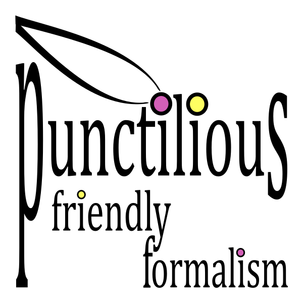

# punctilious

 

  

    A human-friendly and developer-friendly math proof assistant library.

## About

*Punctilious* is a *math proof assistant* python open-source development project. In clear: it intends to
facilitate the study and development of mathematical proofs by human beings.

There exists multiple math proof assistants, including:

* [Coq](https://coq.inria.fr/)
* [Isabelle](https://isabelle.in.tum.de/)
* [Lean](https://leanprover.github.io/)

...and many more. The [proof assistant](https://en.wikipedia.org/wiki/Proof_assistant) page on Wikipedia contains a
general-purpose comparison of these.

In contrast, *punctilious* is a ridiculous [Lilliputian](https://en.wikipedia.org/wiki/Lilliput_and_Blefuscu) with
neither the length, nor the breadth of these time-proven systems.

### So why develop yet another math proof assistant?

Besides being fun and a thrilling learning experience, the focus points of *punctilious* are:

* Human-friendly and developer-friendly inputs (i.e.: write math as we learn it)
* Ease of use
* Human-friendly and developer-friendly outputs (i.e.: readable)

*Punctilious* does not pay much attention to:

* Performance (i.e. for large-scale proof applications)

## Prerequisites

Python 3.x.

## Installation

We are just in the process of publishing *punctilious* on PyPI. Please wait...

## Getting started

Many samples will be provided soon once we will have published our documentation on ReadTheDocs. Please wait...

## Usage

Many samples will be provided soon once we will have published our documentation on ReadTheDocs. Please wait...

## Roadmap

We list here some high-level intentions regarding the future development of *punctilious*.

### Formalization of Math theories

* Continue the formalization of real analysis from Tao 2006
* Document (properly) all inference rules
* Formalize naive set theory
* Formalize propositional logic
* Formalize fundamental geometry
* Formalize the meta-theory of *punctilious*

### Human-friendliness

* Provide simple to understand error / information messages when invalid inputs are provided to inference functions
* Support import math from natural math text (ASCII, Unicode, and LaTeX)
* Support two-columns proofs output
* Support PDF export

### Developer-friendliness

* Support export to and import from punctilious JSON
* Support export to and import from punctilious XML
* Support export to and import from punctilious CSV

## Contributing

Everyone is warmly welcomed to contribute to *punctilious*.

Here are some ideas on how to get started:

* If you feel like a developer: whether you have a clear idea of the feature you would like to work on or not, just feel
  free to get in touch on
  our [Contribute discussion thread](https://github.com/daviddoret/punctilious/discussions/166) and we will be
  most happy to help you from there.

* If you feel like a mathematician (student, amateur, or professional): whether you have a clear idea of the theory you
  would like to work on or not, just feel free to get in touch on
  our [Contribute discussion thread](https://github.com/daviddoret/punctilious/discussions/166) and we will be
  most happy to help you from there.

* If you are looking for ideas on how to contribute, you may wish to have a look at the [roadmap](#roadmap), and the :
  [project](#project).

## Project

We try to manage the *punctilious* project with this [GitHub project](https://github.com/users/daviddoret/projects/1).

## License

[MIT License](https://github.com/daviddoret/punctilious/blob/master/LICENSE)

## Acknowledgments

The list of dependencies is being compiled. Please wait...