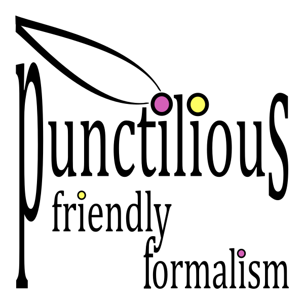

# punctilious
 

  

    A human-friendly math proof assistant library.

## About The Project

## Built With

## Getting Started

## Prerequisites

## Installation

## Usage

## Roadmap

## Contributing

## License

## Contact

## Acknowledgments
