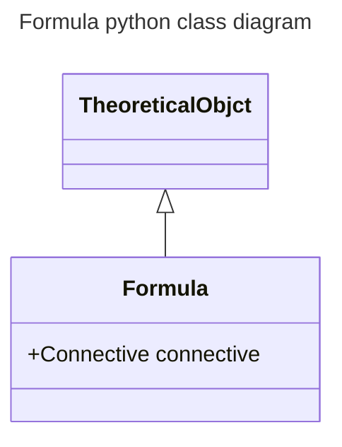

# formula

## Definition

A _formula_ is a tuple (𝒰, 𝑟, 𝘗) where:

- 𝒰 is the universe-of-discourse,
- 𝑟 is a connective,
- 𝘗 is a finite ordered-set of parameters of cardinality > 0.

## Python implementation

_Formulae_ are modeled by the Formula pythonic class.

## Python class diagram

